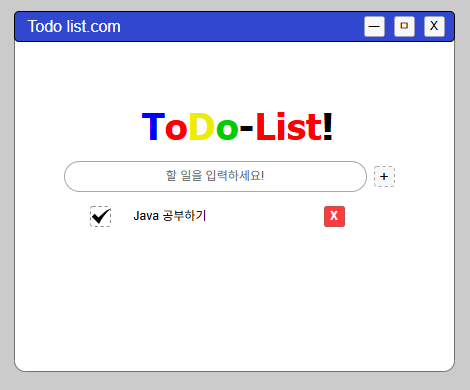

# 프로젝트 기획서

> 작성일: 2026-02-09
> 작성자: 이지현

---

## 1. 프로젝트 개요 

### 프로젝트 이름
todo

### 한 줄 설명
해야 할 일을 기록하고 완료 처리할 수 있는 기본 투두 앱

### 만들게 된 이유 
할 일의 생성, 수정, 삭제, 상태 변경 기능을 구현하며 CRUD 구조를 익히고, 이후 Spring Boot 백엔드와 연동하기 위한 기초 연습으로 진행했습니다.

---
## 2. MVP 범위 설정 (MoSCoW)

### ✅ Must (반드시 구현) - 최대 3개

1. **할 일 추가**: 텍스트 입력 후 버튼 클릭으로 목록에 추가 
2. **할 일 삭제**: 삭제 버튼 클릭으로 목록에서 제거 
3. **완료/미완료 토글**: 체크박스 클릭으로 상태 변경

---
## 3. 시간 예상

### Must 기능별 예상 시간

| 기능 | 예상 시간 | 실제 시간 |
|-----|----------|----------|
|기능 1: 할 일 추가 | 3시간 | 3시간 |
|기능 2: 할 일 삭제 | 2시간 | 3시간 |
|기능 3: 완료/미완료 토클 | 2시간 | 2시간 |
|**합계** | **7시간** | **8시간** |       //**는 굵게

### 현실성 체크 
- [o] Must 기능 합계가 10시간 이내인가? ✅ 8시간
- [o] 버퍼 시간(x 1.5)을 포함해도 20시간 이내인가? ✅ 12시간 

## 4. 화면 구성

### 필요한 화면 목록 
1. **메인 화면 (1개만)**:
    - 포함 요소: 헤더, 입력 폼, 할 일 목록
    - 주요 기능: 추가, 삭제, 토글 모두 이 화면에서 처리 

### 와이어프레임





## 5. 기술 스택 
- HTML5
- CSS3
- JavaScript (ES6+)


### 데이터 저장 방식 
- [o] e.preventDefault 사용해서 할 일 저장  

## 6. 폴더 구조 (이름 정하기라고 보면 댐) 

```
Jihyeon's Todo-List/    프로젝트 이름
|--- todo.html     
|--- css/
|     |
|     |--- todo.css
|
|--- js/
|     |
|     |--- script.js
|
|--- docs/
|     |--- Project-Plan.md
|     |--- todo.drawoio
|
|--- .gitignore
|
|--- README.md

```
---

## 7. 일정 계획

### 주차별 목표

| 주차 | 목표 | 완료 |
|-----|----------|----------|
|1주차 | 기획 + HTML/CSS 기본 구조 + 스타일링  | ⭕ |
|2주차 |  JavaScript 핵심 기능 구현 + 버그 수정 + README 완성   | ⭕ |


